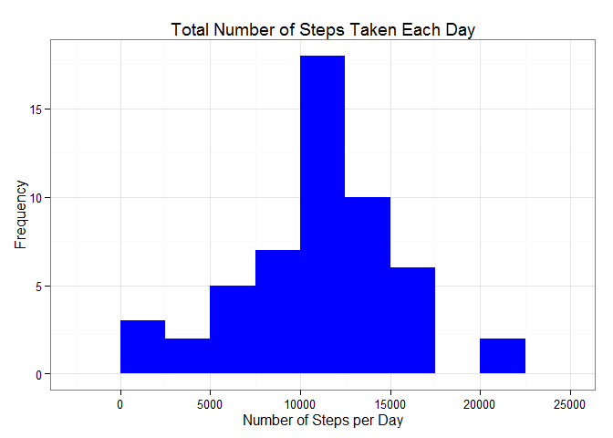
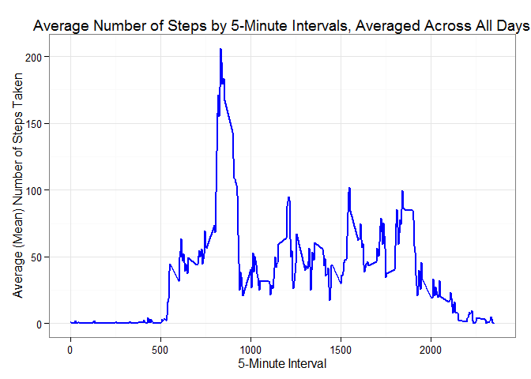
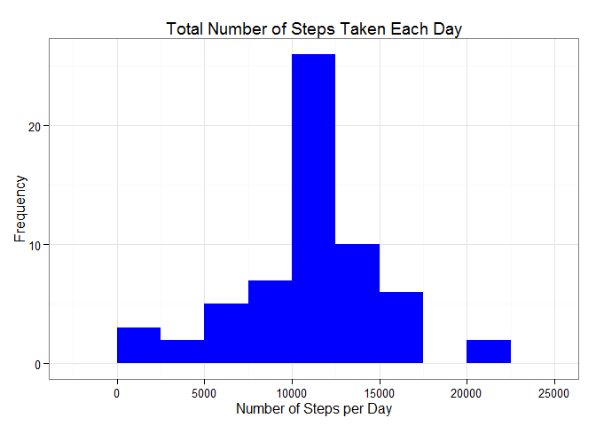
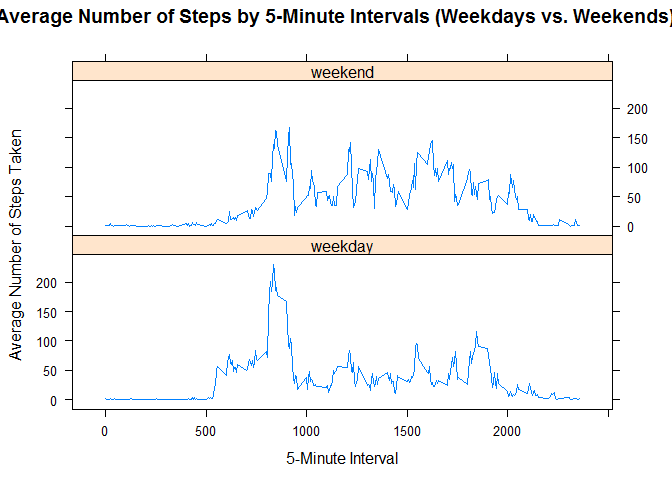

# Reproducible Research: Peer Assessment 1


## Loading and preprocessing the data
##### 1. Load the data (i.e. read.csv())

```r
library(ggplot2)
library(lattice)
if(!file.exists('activity.csv')){
    unzip('activity.zip')
}
ActivityData <- read.csv('activity.csv')
```

##### 2. Process/transform the data (if necessary) into a format suitable for your analysis

```r
Activity <- transform(ActivityData, date = as.Date(date, "%Y-%m-%d"))
ActivityNoNA <- na.omit(Activity)
```

## What is mean total number of steps taken per day?
#### For this part of the assignment, you can ignore the missing values in the dataset.
#### 1. Make a histogram of the total number of steps taken each day

```r
StepsPerDay <- aggregate(steps ~ date, ActivityNoNA, sum)
colnames(StepsPerDay) <- c("date","steps")

ggplot(StepsPerDay, aes(x = steps)) + 
       geom_histogram(fill = "blue", binwidth = 2500) + 
        labs(title="Total Number of Steps Taken Each Day", 
             x = "Number of Steps per Day", y = "Frequency")+  
        theme_bw()
```

<!-- -->

#### 2. Calculate and report the mean and median total number of steps taken per day

```r
StepsPerDayMean <- mean(StepsPerDay$steps)
StepsPerDayMedian <- median(StepsPerDay$steps)
```
The mean total number of steps taken per day is **10766.189**, and the median is **10765**.

## What is the average daily activity pattern?
#### 1. Make a time series plot (i.e. type = "l") of the 5-minute interval (x-axis) and the average number of steps taken, averaged across all days (y-axis)

```r
MeanStepsByInterval <- aggregate(steps ~ interval, ActivityData, mean)
ggplot(MeanStepsByInterval, aes(x=interval, y=steps)) +   
        geom_line(color="blue", size=1) +  
        labs(title="Average Number of Steps by 5-Minute Intervals, Averaged Across All Days", x="5-Minute Interval", y="Average (Mean) Number of Steps Taken") +  
        theme_bw()
```

<!-- -->

#### 2. Which 5-minute interval, on average across all the days in the dataset, contains the maximum number of steps?

```r
MaxInterval <- MeanStepsByInterval[which.max(  
        MeanStepsByInterval$steps),]
```

The **835th** interval has the maximum **206** steps.

## Imputing missing values
#### Note that there are a number of days/intervals where there are missing values (coded as NA). The presence of missing days may introduce bias into some calculations or summaries of the data.
#### 1. Calculate and report the total number of missing values in the dataset (i.e. the total number of rows with NAs)

```r
MissingValues <- sum(is.na(ActivityData$steps))
```
The total number of missing values are **2304**.

#### 2. Devise a strategy for filling in all of the missing values in the dataset. The strategy does not need to be sophisticated. For example, you could use the mean/median for that day, or the mean for that 5-minute interval, etc.
##### The strategy will be to fill in any blanks with the mean value for that interval.

#### 3. Create a new dataset that is equal to the original dataset but with the missing data filled in.

```r
ActivityDataFilled <- ActivityData
for(i in which(is.na(ActivityDataFilled$steps))) {
    int <- ActivityDataFilled$interval[i]
    MeanStepsForInterval <- MeanStepsByInterval[which(MeanStepsByInterval$interval == int), ]$steps
    ActivityDataFilled$steps[i] <- MeanStepsForInterval
}
```

#### 4. Make a histogram of the total number of steps taken each day and Calculate and report the mean and median total number of steps taken per day. 

```r
StepsPerDay <- aggregate(steps ~ date, ActivityDataFilled, sum)
colnames(StepsPerDay) <- c("date","steps")

ggplot(StepsPerDay, aes(x = steps)) + 
       geom_histogram(fill = "blue", binwidth = 2500) + 
        labs(title="Total Number of Steps Taken Each Day", 
             x = "Number of Steps per Day", y = "Frequency")+  
        theme_bw()
```

<!-- -->

```r
StepsPerDayMean <- mean(StepsPerDay$steps)
StepsPerDayMedian <- median(StepsPerDay$steps)
```
The mean total number of steps taken per day is **10766.189**, and the median is **10766.189**.
```

#### Do these values differ from the estimates from the first part of the assignment? 
##### Yes. The mean has stayed the same but the median has moved to to the mean.

#### What is the impact of imputing missing data on the estimates of the total daily number of steps?
##### The frequency of the peak band for total daily number of steps has increased.

## Are there differences in activity patterns between weekdays and weekends?
#### For this part the weekdays() function may be of some help here. Use the dataset with the filled-in missing values for this part (ActivityDataFilled).

#### 1. Create a new factor variable in the dataset with two levels -- "weekday" and "weekend" indicating whether a given date is a weekday or weekend day.

```r
ActivityDataFilled$daytype <-  ifelse(as.POSIXlt(ActivityDataFilled$date)$wday %in% c(0,6), 'weekend', 'weekday')
ActivityDataFilled <- transform(ActivityDataFilled, daytype = factor(daytype))
str(ActivityDataFilled)
```

```
## 'data.frame':	17568 obs. of  4 variables:
##  $ steps   : num  1.717 0.3396 0.1321 0.1509 0.0755 ...
##  $ date    : Factor w/ 61 levels "2012-10-01","2012-10-02",..: 1 1 1 1 1 1 1 1 1 1 ...
##  $ interval: int  0 5 10 15 20 25 30 35 40 45 ...
##  $ daytype : Factor w/ 2 levels "weekday","weekend": 1 1 1 1 1 1 1 1 1 1 ...
```

#### 2. Make a panel plot containing a time series plot (i.e. type = "l") of the 5-minute interval (x-axis) and the average number of steps taken, averaged across all weekday days or weekend days (y-axis). 

```r
StepsByIntervalByDayTypeFilled <- aggregate(steps ~ interval + daytype, ActivityDataFilled, mean)
xyplot(steps ~ interval|daytype, data = StepsByIntervalByDayTypeFilled,
       type = "l", layout = c(1,2),
       xlab="5-Minute Interval", ylab = "Average Number of Steps Taken",
       main="Average Number of Steps by 5-Minute Intervals (Weekdays vs. Weekends)")
```

<!-- -->
